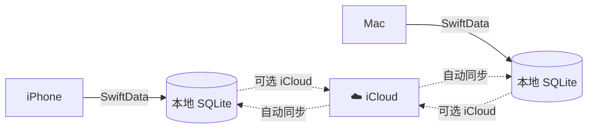
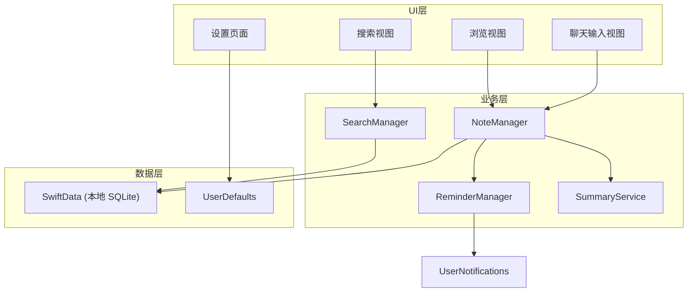

# DayNote — 每日聊天式笔记应用（v3）

一款简洁的 iOS/macOS 笔记应用，支持聊天式快速输入、Markdown 格式记录、全文搜索、每日自动笔记生成、提醒事项、智能摘要和 iCloud 同步。

---

## 问题回答（第三轮）

### Q1: 搜索框会不会与聊天输入框重叠？

**不会重叠。** 搜索和聊天在不同 Tab 页面上：

| Tab | 底部区域 | 说明 |
|-----|---------|------|
| 「今天」 | 聊天输入框 | 仅这个页面底部有输入框 |
| 「搜索」 | 无底部输入 | 搜索栏在页面**顶部**，采用 `.searchable()` 修饰符 |

> [!TIP]
> SwiftUI 的 `.searchable()` 在 iOS 上自动适配导航栏搜索样式（下拉显示搜索栏），完全不占底部空间。即使是 iOS 26 风格，搜索栏也是嵌入导航栏的，与底部 TabBar 和输入框无冲突。

### Q2: Mac 安装会不会界面不适配？

**会有差异，但可以做好适配。** 策略如下：

| 问题 | 解决方案 |
|------|---------|
| TabView 在 Mac 上样式不同 | Mac 用 `NavigationSplitView`（侧边栏），iOS 用 `TabView` |
| 窗口大小可变 | 使用响应式布局，`.frame(minWidth:idealWidth:maxWidth:)` |
| 气泡聊天在大屏太空旷 | 限制最大宽度 `.frame(maxWidth: 600)`，居中显示 |
| 输入框位置 | Mac 上固定在内容区底部，不占全屏宽度 |

```swift
// 平台自适应示例
var body: some View {
    #if os(iOS)
    TabView { /* iOS 用底部 Tab */ }
    #else
    NavigationSplitView {
        SidebarView()   // Mac 用左侧边栏
    } detail: {
        DetailView()
    }
    #endif
}
```

### Q3: 数据保存在哪里？需要服务器吗？

**数据完全保存在本地设备上，不需要服务器。**



| 方案 | 详情 |
|------|------|
| **默认：纯本地** | SwiftData 存储在设备本地 SQLite 数据库中，无需网络、无需账号、零成本 |
| **可选：iCloud 同步** | 开启后自动通过 Apple 账号同步到 iCloud，iPhone ↔ Mac 数据互通。**用户无需额外登录**，使用系统已登录的 Apple ID 即可 |
| **不需要自建服务器** | 完全依赖 Apple 基础设施，纯文本笔记数据量极小 |

> [!IMPORTANT]
> 选择纯本地方案 = **不需要服务器、不需要账号登录、零运维成本**。iCloud 同步也不需要你搭建任何服务器，Apple 全包。

### Q4: 能否接入微信/邮箱登录？

**当前方案不需要登录功能。** 因为数据在本地，没有"用户"的概念。

但如果将来你想做成**多用户/服务器版**，以下是扩展思路：

| 登录方式 | 难度 | 前提条件 |
|---------|------|---------|
| Apple ID 登录 | ⭐ 简单 | 使用 `AuthenticationServices`，Apple 原生集成 |
| 邮箱登录 | ⭐⭐ 中等 | 需要后端服务（Firebase Auth / Supabase 等） |
| 微信扫码登录 | ⭐⭐⭐ 复杂 | 需要微信开放平台备案 + 后端 + 审核 |

> [!NOTE]
> **建议路线**：先做本地版 → iCloud 同步 → 如果需要非 Apple 设备（如 Android/Web），再考虑服务器 + 登录。目前阶段**完全不需要**。

---

## 技术选型

| 项目 | 选择 | 理由 |
|------|------|------|
| **UI 框架** | SwiftUI | 原生 iOS/macOS 跨平台 |
| **数据存储** | SwiftData（本地 SQLite） | 零配置，可升级 CloudKit |
| **搜索** | `.searchable()` + `#Predicate` | 原生全文搜索 |
| **通知** | UserNotifications | 本地定时提醒 |
| **Markdown** | `AttributedString` | 原生渲染 |
| **摘要** | 本地提取 + 可选 AI API | 离线可用 |
| **最低版本** | iOS 17 / macOS 14 | |

---

## 架构设计



---

## 数据模型

```swift
// DailyNote - 每日笔记
@Model class DailyNote {
    @Attribute(.unique) var date: String     // "2026-03-10"
    @Relationship(deleteRule: .cascade, inverse: \NoteEntry.dailyNote)
    var entries: [NoteEntry] = []
    var summary: String?
    var createdAt: Date = Date()
}

// NoteEntry - 笔记条目
@Model class NoteEntry {
    var id: UUID = UUID()
    var content: String = ""
    var isReminder: Bool = false
    var isCompleted: Bool = false
    var reminderTime: Date?
    var shouldContinueRemind: Bool = false
    var createdAt: Date = Date()
    var dailyNote: DailyNote?
}
```

---

## UI 布局方案

### iOS（TabView，4 个 Tab）

```
┌──────────────────────────────────────┐
│  「今天」Tab                          │
│  ┌── 导航栏：3月10日 星期二 ────────┐ │
│  │                                  │ │
│  │  💬 气泡1       09:14            │ │
│  │  ☐ 提醒气泡     10:30            │ │
│  │  💬 气泡3       14:20            │ │
│  │                                  │ │
│  │  [  输入笔记...        ] [发送] │ │
│  └──────────────────────────────────┘ │
│  ┌──────┐┌──────┐┌──────┐┌──────┐   │
│  │ 今天 ││ 浏览 ││ 搜索 ││ 设置 │   │
│  └──────┘└──────┘└──────┘└──────┘   │
└──────────────────────────────────────┘

┌──────────────────────────────────────┐
│  「搜索」Tab                          │
│  ┌── 🔍 搜索笔记...  ──────────────┐ │ ← 顶部搜索栏
│  │                                  │ │
│  │  3月10日 | "...项目会议..."      │ │
│  │  3月8日  | "...SwiftUI学习..."   │ │
│  │  3月5日  | "...周报编写..."      │ │
│  │                                  │ │
│  └──────────────────────────────────┘ │
│  ┌──────┐┌──────┐┌──────┐┌──────┐   │
│  │ 今天 ││ 浏览 ││ 搜索 ││ 设置 │   │
│  └──────┘└──────┘└──────┘└──────┘   │
└──────────────────────────────────────┘
```

### macOS（侧边栏布局）

```
┌───────────┬──────────────────────────┐
│ 侧边栏    │  内容区域                │
│           │                          │
│ ▸ 今天    │  3月10日 星期二    [摘要] │
│ ▸ 浏览    │                          │
│ ▸ 搜索    │  💬 气泡1       09:14    │
│ ▸ 设置    │  ☐ 提醒气泡     10:30    │
│           │  💬 气泡3       14:20    │
│           │                          │
│           │  [输入笔记...   ] [发送] │
└───────────┴──────────────────────────┘
```

---

## 项目文件结构

```
DayNote/
├── DayNoteApp.swift              # App 入口
├── ContentView.swift             # 平台自适应主界面
├── Models/
│   ├── DailyNote.swift
│   ├── NoteEntry.swift
│   └── AppSettings.swift
├── Views/
│   ├── Today/                    # 聊天主界面
│   ├── Browse/                   # 日历浏览
│   ├── Search/                   # 搜索 / 知识库
│   ├── Editor/                   # Markdown 编辑器
│   ├── Settings/                 # 设置
│   └── Components/               # 通用组件
├── Services/
│   ├── NoteManager.swift
│   ├── SearchManager.swift
│   ├── ReminderManager.swift
│   ├── SummaryService.swift
│   ├── LocalSummarizer.swift
│   └── NotificationService.swift
├── Utilities/
│   ├── MarkdownParser.swift
│   └── DateFormatter+Ext.swift
└── Assets.xcassets/
```

---

## 开发阶段

| 阶段 | 内容 | 时间 |
|------|------|------|
| ① 项目搭建 | SwiftData 模型 + ModelContainer | ~2h |
| ② 聊天主界面 | 4-Tab 框架 + 聊天输入 + 气泡 + 自动建日记 | ~3h |
| ③ 搜索知识库 | `.searchable()` + 全文搜索 + 结果跳转 | ~1.5h |
| ④ Markdown | 解析渲染 + 编辑器 + 工具栏 | ~2h |
| ⑤ 提醒 | 通知权限 + 定时调度 + 完成/延后交互 | ~2h |
| ⑥ 智能摘要 | 本地提取 + 可选 AI API + 设置页 | ~2h |
| ⑦ 平台适配 | Mac 侧边栏 + 响应式布局 + 深色模式 + 动画 | ~2h |

---

## 验证计划

1. **iOS Simulator** — 编译运行，测试聊天、搜索、提醒
2. **macOS target** — 验证侧边栏布局和窗口大小适配
3. 功能逐项验证：聊天发送、搜索匹配、Markdown 渲染、通知触发、本地摘要
